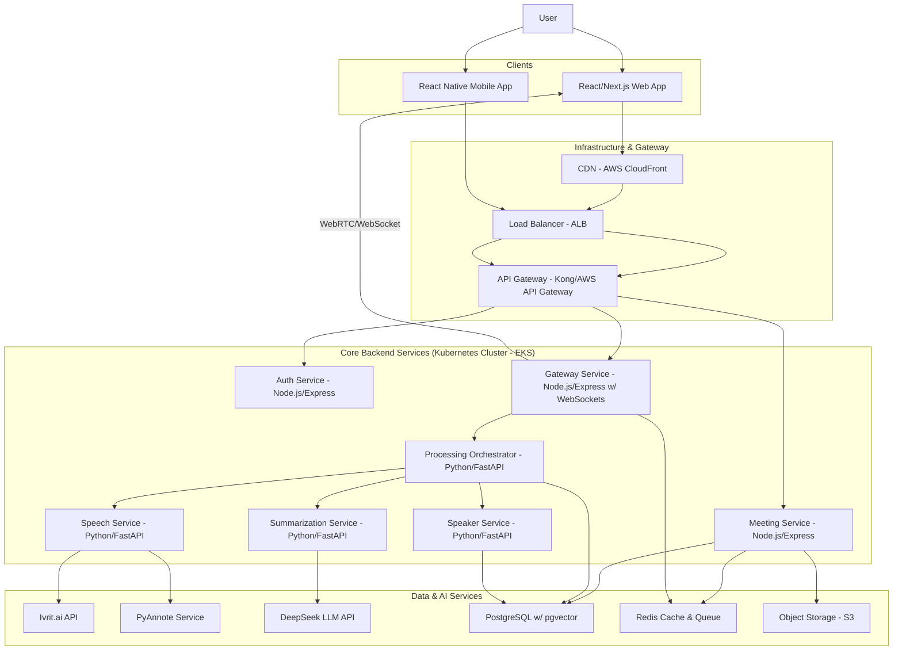

# Production Implementation Plan: B2B SaaS Hebrew Meeting Summarizer

## 1. Executive Summary

This document outlines the complete technical architecture and implementation roadmap for a production-grade, multi-tenant B2B SaaS platform for summarizing Hebrew meetings. The platform will provide real-time transcription, speaker diarization, and AI-powered summarization, with a core focus on persistent, voiceprint-based speaker recognition.

The architecture is designed as a set of cloud-native microservices, ensuring scalability, maintainability, and security. It leverages a modern tech stack, including WebRTC for real-time audio capture, a dual-diarization pipeline with Ivrit.ai and PyAnnote for accuracy, and DeepSeek LLM for nuanced summarization.

---

# 2. System Architecture=

### 2.1. High-Level Microservices Architecture



### 2.2. Real-time Data Flow (During Meeting)

1. **Client (Web/Mobile)** captures audio via WebRTC (`getUserMedia`).
2. Audio stream is sent to the **Gateway Service** via a secure WebSocket connection.
3. The **Gateway Service** chunks the audio into manageable segments (e.g., 5-10 seconds).
4. Each audio chunk is published to a Redis pub/sub channel.
5. The **Speech Service** subscribes to this channel, consumes the audio chunk, and sends it to **Ivrit.ai** for real-time transcription and primary diarization.
6. The transcription and speaker label (`SPK_1`, `SPK_2`, etc.) are returned to the Gateway Service.
7. The **Gateway Service** streams the live transcript back to the client via WebSockets.

### 2.3. Post-Meeting Processing Flow

1. Meeting ends, the full audio is saved to **S3**.
2. A job is pushed to a Redis queue for the **Processing Orchestrator**.
3. **Orchestrator** job starts:
   a.  Retrieves full audio from S3.
   b.  **Speech Service**:
   *   Sends audio to **Ivrit.ai** for a high-accuracy, full-length transcription and diarization.
   *   Sends audio to the internal **PyAnnote Service** for validation diarization.
   *   A "Diarization Merger" algorithm compares results and creates a final, high-confidence speaker timeline.
   c.  **Speaker Service**:
   *   For each detected speaker, a 15-second representative audio snippet is generated.
   *   A speaker embedding (voiceprint) is generated for each speaker using a dedicated model (e.g., `speechbrain/spkrec-ecapa-voxceleb`).
   *   Queries PostgreSQL to find known speakers within the organization by comparing embeddings (cosine similarity).
   *   If a match is found, the speaker is pre-assigned. Otherwise, they remain `Unidentified Speaker X`.
   d.  **Summarization Service**:
   *   Sends the final, speaker-labeled transcript to **DeepSeek LLM**.
   *   Receives the structured summary (key points, action items, etc.).
   *   Parses the transcript with an NLP library (e.g., `spaCy` with a custom Hebrew model) to extract explicitly mentioned names, suggesting potential speaker identities.
4. All results (transcript, summary, speaker data, snippets) are saved to **PostgreSQL** and linked to the meeting.
5. Client is notified via WebSocket or push notification that the meeting processing is complete.

---

## 3. Technology Stack

| Category             | Technology                            | Justification                                                                     |
| -------------------- | ------------------------------------- | --------------------------------------------------------------------------------- |
| **Frontend**   | React, Next.js, TypeScript            | Industry standard, excellent tooling, type safety, and performance with SSR.      |
| **Backend**    | Python (FastAPI), Node.js (Express)   | FastAPI for CPU/IO-bound ML tasks; Node.js for real-time WebSocket communication. |
| **Database**   | PostgreSQL 15+ with `pgvector`      | Robust RDBMS for structured data and native vector support for embeddings.        |
| **AI/ML**      | Ivrit.ai, DeepSeek, PyAnnote          | As per requirements; best-in-class for their respective tasks.                    |
| **Speaker ID** | `speechbrain/spkrec-ecapa-voxceleb` | State-of-the-art lightweight model for generating speaker embeddings.             |
| **Real-time**  | WebRTC, WebSockets, Redis Pub/Sub     | Proven stack for low-latency, real-time audio streaming and communication.        |
| **Deployment** | Docker, Kubernetes (AWS EKS)          | Standard for scalable, resilient microservices deployment.                        |
| **Security**   | OAuth 2.0 (Auth0), SRTP, KMS          | Enterprise-grade authentication and encryption standards.                         |
| **CI/CD**      | GitHub Actions,                       |                                                                                   |
| **Monitoring** | Prometheus, Grafana, OpenTelemetry    | Open-source standard for observability and metrics.                               |

---

## 4. Core Modules & Technical Specifications

### 4.1. Speaker Diarization & Recognition Pipeline

* **Primary System (Ivrit.ai):** Utilized for both real-time and post-meeting diarization. Provides speaker labels (`speaker_0`, `speaker_1`).
* **Validation System (PyAnnote):** An internal, containerized `pyannote.audio` service. It processes the full audio post-meeting to provide a second set of speaker timestamps.
* **Diarization Merger:** A custom algorithm that aligns the timestamps from both systems. Where they overlap with high confidence, the segment is considered validated. Discrepancies are flagged.
* **Fallback Model:** For low-confidence segments or where Ivrit.ai might struggle (e.g., heavy accents), a lightweight model like **`inaSpeechSegmenter`** or a fine-tuned version of `pyannote/speaker-diarization` will be used to re-process just that segment.
* **Voiceprint Generation:** The `SpeakerService` uses a model like **`speechbrain/spkrec-ecapa-voxceleb`** to generate a 256-dimensional embedding vector from a collection of a speaker's audio segments.
* **Persistent Identity:**
  1. On first encounter, a speaker is `Unidentified (SPK_1)`.
  2. User assigns a name (`"Dana"`) via the UI.
  3. The generated voiceprint for `SPK_1` is now permanently associated with `Dana` within that organization's tenant.
  4. In future meetings, when a new speaker's voiceprint has a cosine similarity > 0.9 (configurable) with `Dana`'s stored voiceprint, they are automatically labeled as `Dana`.

### 4.2. Database Schema (PostgreSQL)

```sql
-- Enable vector extension
CREATE EXTENSION IF NOT EXISTS vector;

CREATE TABLE organizations (
    id UUID PRIMARY KEY,
    name VARCHAR(255) NOT NULL,
    subscription_plan VARCHAR(50) DEFAULT 'free',
    created_at TIMESTAMPTZ DEFAULT NOW()
);

CREATE TABLE users (
    id UUID PRIMARY KEY,
    organization_id UUID REFERENCES organizations(id),
    email VARCHAR(255) UNIQUE NOT NULL,
    sso_provider VARCHAR(50),
    created_at TIMESTAMPTZ DEFAULT NOW()
);

CREATE TABLE speakers (
    id UUID PRIMARY KEY,
    organization_id UUID REFERENCES organizations(id),
    name VARCHAR(255) NOT NULL,
    voiceprint_embedding VECTOR(256), -- Stored embedding
    created_at TIMESTAMPTZ DEFAULT NOW(),
    UNIQUE(organization_id, name)
);

CREATE TABLE meetings (
    id UUID PRIMARY KEY,
    organization_id UUID REFERENCES organizations(id),
    title VARCHAR(255) NOT NULL,
    audio_s3_key VARCHAR(1024) NOT NULL,
    status VARCHAR(50) NOT NULL, -- e.g., 'processing', 'completed', 'failed'
    duration_seconds INT,
    created_at TIMESTAMPTZ DEFAULT NOW()
);

CREATE TABLE transcription_segments (
    id BIGSERIAL PRIMARY KEY,
    meeting_id UUID REFERENCES meetings(id),
    speaker_id UUID REFERENCES speakers(id), -- Nullable until identified
    unidentified_speaker_label VARCHAR(50), -- e.g., 'SPK_1'
    start_time_seconds FLOAT NOT NULL,
    end_time_seconds FLOAT NOT NULL,
    hebrew_text TEXT NOT NULL,
    confidence FLOAT
);

CREATE TABLE meeting_summaries (
    id UUID PRIMARY KEY,
    meeting_id UUID REFERENCES meetings(id) UNIQUE,
    summary_json JSONB NOT NULL, -- { key_points: [], action_items: [] }
    created_at TIMESTAMPTZ DEFAULT NOW()
);
```

### 4.3. API Documentation (REST Endpoints)

* **Authentication**
  * `POST /auth/sso/login` - Initiate SSO login.
  * `POST /auth/token/refresh` - Refresh JWT.
* **Meetings**
  * `POST /meetings/upload` - Upload a new audio file for processing.
  * `GET /meetings` - List all meetings for the organization.
  * `GET /meetings/{meetingId}` - Get meeting details, including status.
  * `GET /meetings/{meetingId}/transcript` - Get the full transcript.
  * `GET /meetings/{meetingId}/summary` - Get the AI-generated summary.
  * `GET /meetings/{meetingId}/unidentified_speakers` - Get data for the speaker identification UI (includes 15s audio snippet URL).
* **Speakers**
  * `POST /speakers` - Create/register a new speaker and their voiceprint.
  * `PUT /meetings/{meetingId}/speakers/assign` - Assign a name to an unidentified speaker for a specific meeting. This triggers permanent voiceprint association.
  * `GET /organizations/{orgId}/speakers` - List all known speakers for an organization.
* **WebSocket Events (via Gateway Service)**
  * `session:start` - Initiate a real-time transcription session.
  * `audio:stream` - Client sends audio chunks.
  * `transcript:update` - Server sends live transcription segment.
  * `processing:complete` - Server notifies client that post-meeting analysis is done.

---

## 5. Security & B2B SaaS Features

* **Multi-Tenancy:** All database tables will have an `organization_id` column. Row-Level Security (RLS) policies in PostgreSQL will be implemented to ensure strict data isolation between tenants.
* **Authentication:** Integration with **Auth0** for enterprise SSO (SAML, OpenID Connect) and standard username/password flows.
* **Encryption:**
  * **In-Transit:** TLS 1.3 for all API and WebSocket communication. WebRTC streams encrypted using SRTP.
  * **At-Rest:** AWS S3 server-side encryption (SSE-KMS) for audio files. PostgreSQL database encryption (TDE).
  * **Voiceprints:** While not cryptographically hashed (as that would prevent similarity search), they are sensitive data. They will be encrypted at the application level before being stored in the database, in addition to the database's TDE.
* **Subscription Management:** Integrate with **Stripe** to manage subscription plans, metering (per minute/per meeting), and invoicing.
* **Audit Logging:** A dedicated `audit_logs` table will record all critical actions (login, data access, meeting deletion) with user ID, timestamp, and IP address.

---

## 6. Deployment & CI/CD

1. **Source Code:** Hosted on GitHub.
2. **CI/CD Pipeline:** GitHub Actions will be used.
   * On push to `main`: Run linters, unit tests, and integration tests.
   * On successful tests: Build Docker images for each microservice and push to AWS ECR.
   * Deploy to a staging Kubernetes cluster.
   * On manual approval/tag release: Deploy to the production EKS cluster using Helm charts.
3. **Infrastructure as Code (IaC):** **Terraform** will be used to provision and manage all cloud resources (EKS cluster, RDS, S3, etc.) for reproducibility and disaster recovery.
4. **Monitoring:** **Prometheus** will scrape metrics from all services. **Grafana** will be used for dashboards to monitor system health, API latency, meeting processing times, and transcription accuracy (e.g., Word Error Rate from test sets).

---

## 7. Phased Implementation Roadmap

This project will be developed over **4 sprints (8 weeks total)**.

### **Sprint 1 (Weeks 1-2): Core Backend & Processing Pipeline**

* **Deliverables:**
  * Setup core microservices structure (Orchestrator, Speech, Speaker).
  * Integrate Ivrit.ai and PyAnnote in the `SpeechService`.
  * Implement post-meeting processing with audio from S3.
  * Initial database schema setup.
  * **Milestone:** Successfully process an audio file end-to-end (diarization + transcription) via an internal trigger.

### **Sprint 2 (Weeks 3-4): Speaker Recognition & Summarization**

* **Deliverables:**
  * Implement voiceprint generation in the `SpeakerService`.
  * Integrate `pgvector` for storing and querying embeddings.
  * Develop the automatic speaker matching logic.
  * Integrate DeepSeek LLM into the `SummarizationService`.
  * **Milestone:** A processed meeting automatically identifies previously registered speakers and generates a summary.

### **Sprint 3 (Weeks 5-6): Frontend & User-Facing Features**

* **Deliverables:**
  * Build Next.js frontend with basic user dashboard.
  * Create the post-meeting speaker identification UI (with audio snippets).
  * Implement NLP-based name suggestion engine.
  * Setup basic user authentication (email/password).
  * **Milestone:** A user can upload a meeting, have it processed, and manually assign names to unidentified speakers in the UI.

### **Sprint 4 (Weeks 7-8): B2B Features, Real-time & Deployment**

* **Deliverables:**
  * Implement real-time audio capture and streaming transcription via WebRTC/WebSockets.
  * Integrate multi-tenancy (RLS) and enterprise SSO (Auth0).
  * Integrate Stripe for subscription management.
  * Finalize CI/CD pipeline and production Kubernetes deployment.
  * Setup monitoring dashboards and alerting.
  * **Milestone:** Platform is live in production. Real-time meetings are supported. A new organization can sign up and use the service.

---

## 8. Risk Mitigation

| Risk                               | Probability | Impact | Mitigation Strategy                                                                                                      |
| ---------------------------------- | ----------- | ------ | ------------------------------------------------------------------------------------------------------------------------ |
| **Low Diarization Accuracy** | Medium      | High   | Implement the dual-system (Ivrit.ai + PyAnnote) with a merger. Use fallback models for low-confidence segments.          |
| **Hebrew NLP Challenges**    | Medium      | Medium | Utilize pre-trained Hebrew NLP models (e.g., from Aleph-Bet) and fine-tune on internal data for name entity recognition. |
| **Scalability Bottlenecks**  | High        | High   | Design all processing to be asynchronous via queues. Use Kubernetes for horizontal auto-scaling of services.             |
| **Data Privacy & Security**  | Low         | Severe | Strict adherence to E2EE, encryption-at-rest, tenant isolation via RLS, and regular security audits.                     |
